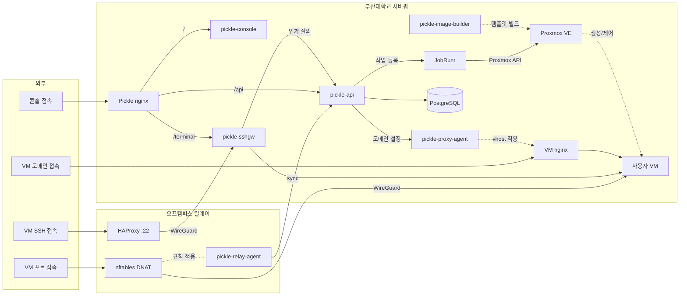

# pickle-infra-example

부산대학교 클라우드 플랫폼(Pickle)의 인프라 계층이 어떻게 구성돼 있는지 보여주는 공개
예시본입니다. 실제 인프라 레포지토리는 비공개이며, 여기에는 프로비저닝·배포·검증 스크립트와
호스트 설정을 옮겨 담고 민감한 값을 치환해 두었습니다.

> **여기 적힌 IP 주소와 관리 포트, 볼트 경로는 실제 값이 아닙니다.** 아래
> [무엇을 바꿨나](#무엇을-바꿨나)에 치환 목록이 있습니다. 도메인 이름은 치환하지
> 않았습니다 — 이 플랫폼이 서비스하는 이름이라 공개돼 있고, 가려 두면 스크립트가
> 무엇을 하는지 읽을 수 없게 됩니다.

플랫폼 전체는 [PNUops](https://github.com/PNUops) 프로필에서, 애플리케이션 코드는
[pickle-api](https://github.com/PNUops/pickle-api)와
[pickle-console](https://github.com/PNUops/pickle-console)
같은 공개 레포지토리에서 볼 수 있습니다.

## 운영 대상

캠퍼스 방화벽이 인바운드를 막기
때문에 오프캠퍼스 SSH는 외부 릴레이가 받아, 캠퍼스가 아웃바운드로 개통한 WireGuard
터널로 넘깁니다.

```
pickle.example.ac.kr ──┐                   외부 릴레이 (오프캠퍼스 SSH)
*.example.dev        ──┤ :80/:443           HAProxy(send-proxy-v2)
                       ▼                      │ 캠퍼스발 아웃바운드 WireGuard
pve-node (Proxmox VE) ────────────────────────────┘
 ├─ vmbr1 (인프라)
 │   ├─ LXC 100 reverse-proxy  nginx(HTTP vhost·SNI 스트림) + proxy-agent + certbot
 │   ├─ LXC 101 pickle-app     PostgreSQL + pickle-api + nginx(콘솔 정적·/api 프록시)
 │   └─ LXC 102 pickle-sshgw   proxyfront + sshpiperd + 터미널 브리지 + WireGuard 종단
 └─ vmbr2 (사용자, 격리)       사용자 VM (Ubuntu cloud-init 템플릿에서 클론)
```

vmbr1은 인프라 전용, vmbr2는 사용자 전용이고 둘 사이에 직접 경로가 없습니다. 산출물은
전부 셸과 마크다운입니다.

## 주요 기능

플랫폼은 VM 신청·승인·생성, SSH와 웹 터미널 접속, 도메인 공개, 만료와
삭제까지를 다룹니다. 이 레포지토리가 맡는 부분은 아래와 같습니다.

- **프로비저닝**: 호스트 위의 컨테이너와 사용자 VM 템플릿을 스크립트로 만듭니다.
- **배포**: 각 서비스를 올리고, 헬스 체크를 통과하지 못하면 직전 상태로 되돌립니다.
- **정책 적용**: TLS 암호군, 로그 보존, 인그레스 설정 같은 호스트 정책을 한 번에 맞춥니다.
- **점검**: 살아 있는 시스템에 실제 요청을 보내는 스모크와 읽기 전용 헬스 스냅샷으로
  상태를 확인합니다.
- **예약 작업**: 백업과 헬스체크를 타이머로 돌리고, 실패가 조용히 묻히지 않게 기록과
  알림을 붙입니다.

## 동작 방식

- **파괴적 변경 전에 백업합니다.** 설정 파일을 덮어쓰는 스크립트는 손대는 파일을
  타임스탬프 폴더에 먼저 복사합니다.
- **배포는 헬스 게이트를 통과해야 끝납니다.** `deploy-api.sh`는 새 jar로 서비스를 올린 뒤
  헬스 체크가 통과하지 못하면 직전 아티팩트로 되돌립니다. `deploy-sshgw.sh`는 바이너리
  세 개를 한 세트로 원자 교체해, 절반만 새 버전인 상태를 만들지 않습니다.
- **위생 검사에 셀프테스트가 붙어 있습니다.** `hygiene.sh`는 매 실행마다 합성 위반
  케이스로 자기 검사 로직이 살아 있는지 먼저 확인한 뒤 본 검사를 수행합니다.
- **주기 작업의 실패가 남습니다.** `cron-wrap.sh`가 성공과 실패 마커를 기록하고, systemd
  `OnFailure`가 `ops-unit-failed.sh`로 알림을 띄웁니다.

## 구성

```
hosts/pve-node/       호스트 네트워크 설정, systemd 유닛과 타이머   // 백업·헬스체크·실패 알림
lightsail/        외부 릴레이 설정: HAProxy, nftables, WireGuard, sysctl, 커널 모듈
scripts/          프로비저닝·배포·정책 적용·검증·스모크
runbooks/         운영 절차                                    // 이 예시본에는 일부만 포함
```

### scripts/

| 분류 | 스크립트 |
|---|---|
| 프로비저닝 | `create-app-lxc.sh`, `create-sshgw-lxc.sh` |
| 배포 | `deploy-api.sh`, `deploy-console.sh`, `deploy-proxy-agent.sh`, `deploy-relay.sh`, `deploy-sshgw.sh`, `sync-systemd-units.sh` |
| 정책 적용 | `apply-tls-ciphers.sh`, `apply-terminal-ingress.sh`, `apply-log-retention.sh`, `apply-main-domain-vhost.sh`, `apply-ops-timers.sh`, `apply-platform-inventory.sh`, `apply-settings.sh`, `apply-terms.sh`, `apply-os-catalog.sh`, `apply-relay-token.sh` |
| 운영 | `db-backup.sh`, `health-check.sh`, `cron-wrap.sh`, `ops-unit-failed.sh` |
| 검증 | `verify.sh`, `hygiene.sh`, `setup-hooks.sh`, `pre-commit.sh`, `commit-msg.sh` |
| 스모크 | `smoke-provisioning.sh`, `smoke-http-publish.sh`, `smoke-ssh-gateway.sh`, `smoke-web-terminal.sh`, `smoke-account-ops.sh`, `smoke-dashboards-notify.sh`, `smoke-prod.sh` |

스모크는 목이 아니라 살아 있는 시스템에 실제 요청을 보냅니다. `smoke-provisioning.sh`는
회원가입부터 인증, 그룹 생성, VM 신청, 관리자 승인, 프로비저닝 완료 대기, SSH 도달 확인,
전원 왕복, 삭제, DB 정합 검증까지 한 번에 통과시킵니다.

사용자 VM 템플릿을 만드는 빌드 레시피는 이 레포지토리에 없습니다. 공개 레포지토리
**pickle-image-builder**가 그 역할을 맡습니다.

### runbooks/

이 예시본에는 `new-environment.md`(신규 환경 관통 구축 순서 — 환경별로 바꿀 값 표와
사람만 할 수 있는 단계·절차가 없는 지점 명시), `drift-resolution.md`(DB와 하이퍼바이저
상태가 어긋났을 때의 판정 절차), `db-restore.md`(백업 복원)를 담았습니다. 나머지 재구축과
복구 절차는 비공개 레포지토리에 둡니다.

## 검증

```bash
scripts/verify.sh        # 모든 셸 스크립트 shellcheck 전수 + 위생 검사
```

`verify.sh`는 커밋 전 필수입니다. shellcheck 위반이 하나라도 있으면 실패하고, 이어서 도는
위생 검사는 레포지토리에 남으면 안 되는 참조나 표기를 찾습니다.

## 무엇을 바꿨나

원본에서 이 레포지토리로 옮기며 치환한 값입니다. 아래는 전부 실제 값이 아닙니다. **도메인 이름은 이 목록에 없습니다**: 플랫폼이 실제로 서비스하는 이름이 그대로 들어 있습니다.

| 항목 | 이 레포지토리의 값 |
|---|---|
| 호스트 LAN 주소·게이트웨이 | `192.0.2.10/24`, `192.0.2.1` |
| 리버스 프록시 공인 IP | `203.0.113.10` |
| 패스스루 대상 IP | `203.0.113.20` |
| 외부 릴레이 공인 IP | `198.51.100.10` |
| 관리 SSH 포트 | `22` |
| 시크릿 볼트 경로 | `$VAULT/` |

`192.0.2.0/24`와 `198.51.100.0/24`, `203.0.113.0/24`는 RFC 5737이 문서화 용도로 예약한
대역이라 실제 인터넷에 존재하지 않습니다. 관리 SSH 포트도 한눈에 자리표시자로 보이도록
표준값을 적었습니다.

내부 사설 대역(`198.19.0.0/16`, `198.18.0.0/16`), LXC 번호, 서비스 포트는 그대로
두었습니다. 이 값들이 없으면 스크립트가 무슨 일을 하는지 읽히지 않기 때문입니다.

자격증명 값은 원본에도 없습니다. 인프라 레포지토리는 자격증명을 담지 않고, 볼트 구성은
[pickle-secrets-example](https://github.com/PNUops/pickle-secrets-example)에서 따로
설명합니다.

## 전체 아키텍처

<!-- arch:begin — 레포지토리 공통 블록입니다. 손으로 고치지 마세요. -->


| 레포지토리 | 역할 |
|---|---|
| [pickle-api](https://github.com/PNUops/pickle-api) | REST API와 프로비저닝 워커 (Spring Boot 4, Java 25, PostgreSQL 18, JobRunr) |
| [pickle-console](https://github.com/PNUops/pickle-console) | 사용자·관리자 웹 콘솔 (React 19, TypeScript) |
| [pickle-sshgw](https://github.com/PNUops/pickle-sshgw) | SSH 게이트웨이와 웹 터미널 브리지 (sshpiperd, Go) |
| [pickle-proxy-agent](https://github.com/PNUops/pickle-proxy-agent) | nginx 리버스 프록시 제어 에이전트 (Go) |
| [pickle-relay-agent](https://github.com/PNUops/pickle-relay-agent) | 오프캠퍼스 릴레이의 nftables DNAT 에이전트 (Go) |
| [pickle-image-builder](https://github.com/PNUops/pickle-image-builder) | 사용자 VM OS 이미지 빌드 레시피 (shell, virt-customize) |
| [pickle-infra](https://github.com/PNUops/pickle-infra) (비공개) | 인프라 프로비저닝 스크립트와 운영 런북 (shell) |
| [pickle-infra-example](https://github.com/PNUops/pickle-infra-example) | 프로비저닝·배포 스크립트와 런북 샘플 |
| [pickle-secrets](https://github.com/PNUops/pickle-secrets) (비공개) | 호스트 시크릿 볼트 (git-crypt) |
| [pickle-secrets-example](https://github.com/PNUops/pickle-secrets-example) | 볼트 레이아웃과 git-crypt 운용 절차 |
<!-- arch:end -->
